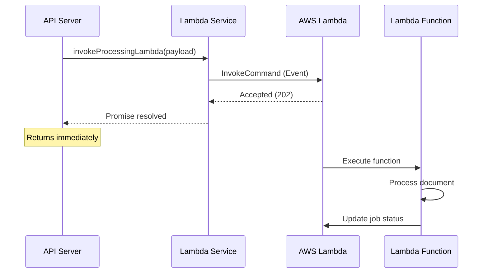

## Overview

The Lambda service provides an interface for invoking AWS Lambda functions asynchronously to handle document processing tasks.

## Configuration

The service requires the following environment variables:

<ParamField path="AWS_REGION" type="string" required>
  AWS region where the Lambda function is deployed
</ParamField>

<ParamField path="LAMBDA_NAME" type="string" required>
  Name or ARN of the Lambda function to invoke
</ParamField>

## Functions

### invokeProcessingLambda

Invokes the document processing Lambda function asynchronously.

#### Signature

```javascript
exports.invokeProcessingLambda = async payload => {
  // Implementation
}
```

#### Parameters

<ParamField path="payload" type="object" required>
  The payload object to send to the Lambda function. Typically includes job details such as:
  - `jobId` - Unique job identifier
  - `inputKey` - S3 key of the input file
  - `outputKey` - S3 key for the processed output
  - `optimizationLevel` - Processing configuration
</ParamField>

#### Returns

The function returns a Promise that resolves when the Lambda invocation request is accepted (not when processing completes).

<Warning>
  This function does not return the Lambda execution result. It uses `InvocationType: 'Event'` for asynchronous execution.
</Warning>

#### Implementation

```javascript
const { LambdaClient, InvokeCommand } = require('@aws-sdk/client-lambda');

const lambda = new LambdaClient({
  region: process.env.AWS_REGION,
});

exports.invokeProcessingLambda = async payload => {
  if (!process.env.LAMBDA_NAME) throw new Error('LAMBDA_NAME env variable is not set');

  const command = new InvokeCommand({
    FunctionName: process.env.LAMBDA_NAME,
    InvocationType: 'Event',
    Payload: Buffer.from(JSON.stringify(payload)),
  });

  await lambda.send(command);
};
```

## Invocation Type

The service uses **Event** invocation type:

<Info>
  `InvocationType: 'Event'` invokes the Lambda function asynchronously. AWS acknowledges the request immediately and processes it in the background.
</Info>

### Invocation Types Comparison

| Type | Behavior | Use Case |
|------|----------|----------|
| **Event** | Asynchronous, returns immediately | Background processing (used here) |
| RequestResponse | Synchronous, waits for result | Real-time responses needed |
| DryRun | Validates parameters only | Testing permissions |

## Example Usage

### Basic Invocation

```javascript
const { invokeProcessingLambda } = require('./services/lambdaService');

const payload = {
  jobId: 'job-123',
  inputKey: 'uploads/original/file-456',
  outputKey: 'uploads/processed/job-123_medium.pdf',
  optimizationLevel: 'medium'
};

await invokeProcessingLambda(payload);
console.log('Processing job initiated');
```

### With Error Handling

```javascript
const { invokeProcessingLambda } = require('./services/lambdaService');

try {
  await invokeProcessingLambda({
    jobId: 'job-123',
    inputKey: 'uploads/original/file-456',
    outputKey: 'uploads/processed/job-123_high.pdf',
    optimizationLevel: 'high'
  });
  console.log('Lambda invocation successful');
} catch (error) {
  console.error('Failed to invoke Lambda:', error.message);
  // Handle error: update job status, notify client, etc.
}
```

## Error Handling

The function throws errors in the following scenarios:

<AccordionGroup>
  <Accordion title="Missing LAMBDA_NAME Environment Variable">
    ```javascript
    Error: 'LAMBDA_NAME env variable is not set'
    ```
    
    Ensure the `LAMBDA_NAME` environment variable is configured before calling this function.
  </Accordion>
  
  <Accordion title="Invalid Payload">
    AWS may reject the invocation if the payload:
    - Exceeds size limits (256 KB for Event invocations)
    - Contains invalid JSON structure
    - Is not properly serialized
  </Accordion>
  
  <Accordion title="AWS Permissions">
    The IAM role must have `lambda:InvokeFunction` permission for the target Lambda function.
  </Accordion>
  
  <Accordion title="Lambda Function Not Found">
    Occurs when the specified `LAMBDA_NAME` does not exist or is inaccessible in the configured region.
  </Accordion>
</AccordionGroup>

## Payload Serialization

The payload is serialized to JSON and converted to a Buffer:

```javascript
Payload: Buffer.from(JSON.stringify(payload))
```

<Note>
  Ensure your payload object is JSON-serializable. Avoid passing functions, circular references, or undefined values.
</Note>

## Asynchronous Processing Flow



<Tip>
  Since invocation is asynchronous, implement status polling or webhooks to track job completion.
</Tip>

## IAM Permissions Required

Your AWS IAM role needs the following policy:

```json
{
  "Version": "2012-10-17",
  "Statement": [
    {
      "Effect": "Allow",
      "Action": "lambda:InvokeFunction",
      "Resource": "arn:aws:lambda:REGION:ACCOUNT:function:FUNCTION_NAME"
    }
  ]
}
```

## Monitoring

Monitor Lambda invocations through:

- **CloudWatch Logs**: Lambda execution logs
- **CloudWatch Metrics**: Invocation count, errors, duration
- **X-Ray**: Distributed tracing for end-to-end visibility