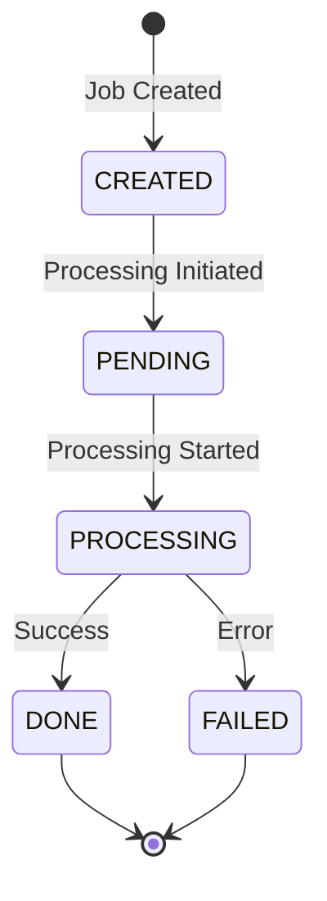

## GET /api/status/:jobId

Retrieves the current status and details of a document optimization job.

## Path Parameters

<ParamField path="jobId" type="string" required>
  The unique job identifier returned from the `/api/upload-url` endpoint.
</ParamField>

## Response

<ResponseField name="jobId" type="string">
  The unique identifier for the job.
</ResponseField>

<ResponseField name="status" type="string">
  Current status of the job. Possible values:
  - `CREATED` - Job record created, waiting for processing to start
  - `PENDING` - Job is queued for processing
  - `PROCESSING` - Document is being optimized
  - `DONE` - Optimization completed successfully
  - `FAILED` - Processing failed
</ResponseField>

<ResponseField name="optimizationLevel" type="string">
  The optimization level requested for this job (`low`, `medium`, or `high`).
</ResponseField>

<ResponseField name="createdAt" type="string">
  ISO 8601 timestamp when the job was created.
</ResponseField>

<ResponseField name="updatedAt" type="string">
  ISO 8601 timestamp when the job was last updated.
</ResponseField>

<ResponseField name="errorMsg" type="string | null">
  Error message if the job failed, otherwise `null`.
</ResponseField>

## Error Codes

| Status Code | Error Message | Description |
|-------------|---------------|-------------|
| 404 | Job not found | No job exists with the provided job ID |
| 500 | Failed to retrieve job status | Server error occurred while fetching job status |

## Example Request

```bash
curl https://api.example.com/api/status/abc123-def456-ghi789 \
  -H "x-api-key: your-api-key-here"
```

## Example Response (Processing)

```json
{
  "jobId": "abc123-def456-ghi789",
  "status": "PROCESSING",
  "optimizationLevel": "medium",
  "createdAt": "2026-03-03T10:30:00.000Z",
  "updatedAt": "2026-03-03T10:30:15.000Z",
  "errorMsg": null
}
```

## Example Response (Completed)

```json
{
  "jobId": "abc123-def456-ghi789",
  "status": "DONE",
  "optimizationLevel": "medium",
  "createdAt": "2026-03-03T10:30:00.000Z",
  "updatedAt": "2026-03-03T10:32:45.000Z",
  "errorMsg": null
}
```

## Example Response (Failed)

```json
{
  "jobId": "abc123-def456-ghi789",
  "status": "FAILED",
  "optimizationLevel": "high",
  "createdAt": "2026-03-03T10:30:00.000Z",
  "updatedAt": "2026-03-03T10:31:20.000Z",
  "errorMsg": "Unsupported file format"
}
```

## Polling Recommendations

<Note>
Implement exponential backoff when polling this endpoint:
- Start with 2-second intervals
- Increase delay after each check (e.g., 2s, 4s, 8s, 15s, 30s)
- Maximum interval of 30-60 seconds
- Stop polling once status is `DONE` or `FAILED`
</Note>

## Status Transitions


